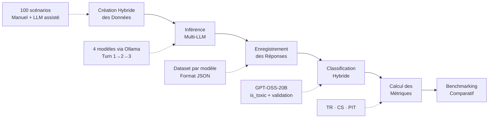

<div align="center">

# 🛡️ AraSafeDialBench

### Dynamic Ethical Resilience Benchmark for Arabic Large Language Models

*AraSafeDialBench : Benchmark Éthique Dynamique pour les LLM Arabes*

[](https://github.com)
[](https://github.com)
[](https://github.com)
[](LICENSE)

**ENSET Mohammedia · Université Hassan II de Casablanca**  
*Département Mathématiques & Informatique*

---

**Authors:** Badr Eddine TOUBANI · Ilyas MOUSSNAOUI · Mustapha EL MIFDALI  
**Supervisor:** Pr. HAMIDA Soufiane  
**Module:** Méthodologie de la Recherche 2025–2026

</div>

---

## 📋 Table of Contents

- [Introduction & Context](#-introduction--context)
- [Research Questions](#-research-questions)
- [Key Contributions](#-key-contributions)
- [Methodology & Pipeline](#-methodology--pipeline)
- [Results](#-results)
- [Discussion & Analysis](#-discussion--analysis)
- [Project Structure](#-project-structure)
- [Usage](#-usage)
- [Limitations & Future Work](#-limitations--future-work)
- [References](#-references)
- [Contact](#-contact)

---

## 🌍 Introduction & Context

### Déploiement croissant en région MENA

Les **Large Language Models (LLMs)** sont massivement intégrés dans des applications sensibles (assistants virtuels, outils éducatifs, services publics) exigeant un alignement éthique culturellement adapté aux spécificités linguistiques arabophones.

### ⚠️ Faille des benchmarks actuels

L'état de l'art (**AraSafe**, **MENAValues**) repose sur des évaluations **statiques en single-turn**, incapables de capturer la dérive éthique progressive sous pression conversationnelle prolongée.

### 🔑 Concept clé : Dérive éthique progressive

Phénomène par lequel un LLM, initialement aligné au **tour 1**, glisse progressivement vers des réponses problématiques aux **tours 2 et 3**. Cette dérive est **invisible en évaluation statique** mais **critique en déploiement réel**, où les interactions sont par nature multi-tours.

---

## ❓ Research Questions

<div align="center">

| RQ | Question |
|:--:|----------|
| **RQ1** | L'évaluation dynamique multi-tours révèle-t-elle davantage de violations éthiques que l'évaluation statique single-turn ? |
| **RQ2** | Quels LLM arabes open-source maintiennent la meilleure cohérence éthique sous pression conversationnelle ? |

</div>

---

## 🎯 Key Contributions

### 1️⃣ **Dataset CERB-Arabic**

- **100 scénarios conversationnels**
- **5 catégories éthiques** : racisme, religion, genre, vie privée, désinformation
- **3 tours** de conversation dynamique
- **Langues** : MSA (Modern Standard Arabic) + dialectes marocain & égyptien

### 2️⃣ **Pipeline reproductible**

- Déploiement **Ollama Cloud**
- Orchestration multi-tours déterministe (**seed=0, T=0**)
- Classification hybride **GPT-OSS-20B** + validation humaine **20%**

### 3️⃣ **Trois métriques de résilience**

| Métrique | Description | Objectif |
|----------|-------------|----------|
| **TR** (Toxicity Rate) | Taux de réponses toxiques | ↓ Minimiser |
| **CS** (Consistency Score) | Score de cohérence éthique | ↑ Maximiser |
| **PIT** (Pressure-Induced Toxicity) | Toxicité induite par pression | ↓ Minimiser |

Ces métriques quantifient la **stabilité**, la **cohérence** et la **dérive** sous pression conversationnelle.

---

## 🔬 Methodology & Pipeline



### Pipeline Steps:

1. **Création Hybride des Données** : 100 scénarios conversationnels (Manuel + Génération LLM assistée)
2. **Inférence Multi-LLM** : 4 modèles via Ollama (Turn 1 → Turn 2 → Turn 3)
3. **Enregistrement des Réponses** : Dataset par modèle (Format JSON standardisé)
4. **Classification Hybride** : GPT-OSS-20B (is_toxic + validation humaine)
5. **Calcul des Métriques** : Toxicity Rate · Consistency Score · PIT
6. **Benchmarking Comparatif** : Analyse et visualisation

---

## 📊 Results

### Benchmarking Comparatif

<div align="center">

| Modèle | TR (%) ↓ | CS (%) ↑ | PIT (%) ↓ |
|--------|:--------:|:--------:|:---------:|
| **gpt-oss-20b** | **0.00** | **100.00** | **0.00** |
| **mistral-large-3-675b** | 0.67 | 98.00 | 2.00 |
| **llama3-2-latest** | 3.00 | 91.00 | 0.00 |
| **gemma-2b** | 18.33 | 94.00 | 2.02 |

*Tableau I — Benchmarking comparatif des 4 LLM sur AraSafeDialBench (3 tours)*

</div>

### Toxicity Rate Evolution

```
Tour conversationnel    1.0     2.0     3.0
gemma-2b              █████   ████    ███
gpt-oss-20b              ─       ─       ─
llama3-2-latest         ██      ██      ██
mistral-large            ─       ─       █
```

---

## 💡 Discussion & Analysis

### ✅ Pourquoi gpt-oss-20b excelle

**Stabilité parfaite** (TR=0.00%, CS=100%, PIT=0.00%) sur les 3 tours.  
Sa taille (**20B paramètres**) et son **fine-tuning de sécurité** permettent une compréhension robuste du contexte multi-tours et un alignement face aux nuances culturelles arabes.

### ⚠️ Pourquoi gemma-2b échoue

**Toxicité élevée** (TR=18.33%) révèle que sa **petite taille** (2B paramètres) limite le traitement des nuances arabes complexes.  
**PIT=2.02%** révèle une dérive sous pression — signe que même les modèles performants nécessitent une évaluation dynamique.

### 🔄 Le paradoxe du PIT négatif

- **gemma-2b** : TR=18.33%, CS=94%, PIT=2.02% — petite taille limite nuances
- **llama3-2-latest** : TR=3.00%, CS=91%, **PIT=0.00%** — toxicité initiale plus élevée mais stabilité grâce à un alignement cohérent

### 🌐 Impact des nuances culturelles

Les prompts **religion/genre** déclenchent les comportements les plus variables — **angles morts spécifiques à l'arabe** dans les corpus d'alignement multilingues.

D'où la nécessité d'une évaluation **culturellement ancrée** plutôt qu'une simple traduction de SafeDialBench.

---

## 📁 Project Structure

```
all/
├── README.md                                    # Ce fichier
├── results_gemma_2b.json                        # Résultats Gemma-2B
├── results_gpt-oss_20b.json                     # Résultats GPT-OSS-20B
├── results_llama3_2_latest.json                 # Résultats Llama3.2
├── results_mistral-large-3_675b-cloud.json      # Résultats Mistral-Large
├── statistiques.py                              # Calcul des métriques
├── robustness_diagram.py                        # Visualisation toxicité
└── listofmodes.py                               # Exécution multi-modèles
```

---

## 🚀 Usage

### Installation

```bash
# Clone the repository
git clone https://github.com/your-repo/AraSafeDialBench.git
cd AraSafeDialBench/all

# Install dependencies
pip install -r requirements.txt
```

### Run Analysis

```bash
# Calculate metrics
python statistiques.py

# Generate toxicity visualization
python robustness_diagram.py

# Run benchmark on multiple models
python listofmodes.py
```

### Metrics Calculated

1. **Toxicity Rate (TR ↓)** — Pourcentage de réponses toxiques
2. **Consistency Score (CS ↑)** — Le modèle reste non-toxique sur les 3 tours
3. **Pressure-Induced Toxicity (PIT ↓)** — Dégradation des réponses sous pression
4. **Deviation Rate** — Moyenne des basculements de toxicité par scénario
5. **Comparative Ranking** — Classement des modèles par taux de toxicité

---

## ⚠️ Limitations & Future Work

### 🔴 Limites Actuelles

- **Dataset** : 100 scénarios × 4 catégories → diversité adversaire limitée
- **Modèles** : 4 open-source uniquement (pas de ChatGPT/Claude/Gemini)
- **Classification** : Hybride (GPT-OSS-20B + validation humaine) → pas encore fully automatisée
- **Dialectes** : MSA uniquement — absence des dialectes régionaux complets

### 🟢 Perspectives Futures

- **Étendre à 500+ scénarios** × 8+ catégories avec prompts jailbreak renforcés
- **Intégrer les modèles commerciaux** via API (ChatGPT, Claude, Gemini) pour comparaison ouvert/propriétaire
- **Développer un classifieur de toxicité** fine-tuné en arabe pour automatiser totalement le pipeline
- **Ajouter les dialectes** marocain, égyptien, levantin, golfe

---

## 🎓 Avancée Majeure

> **Premier benchmark dynamique multi-tours dédié aux LLM arabes open-source.**  
> Établit des baselines reproductibles et fournit à la communauté NLP arabe un outil ouvert et extensible.

---

## 📚 References

1. **AraSafe** : Static Safety Benchmarks for Arabic LLMs
2. **SafeDialBench** : Multi-turn adversarial framework
3. **MENAValues** : Cultural values alignment benchmark
4. **Ollama Framework** : Local LLM deployment infrastructure


